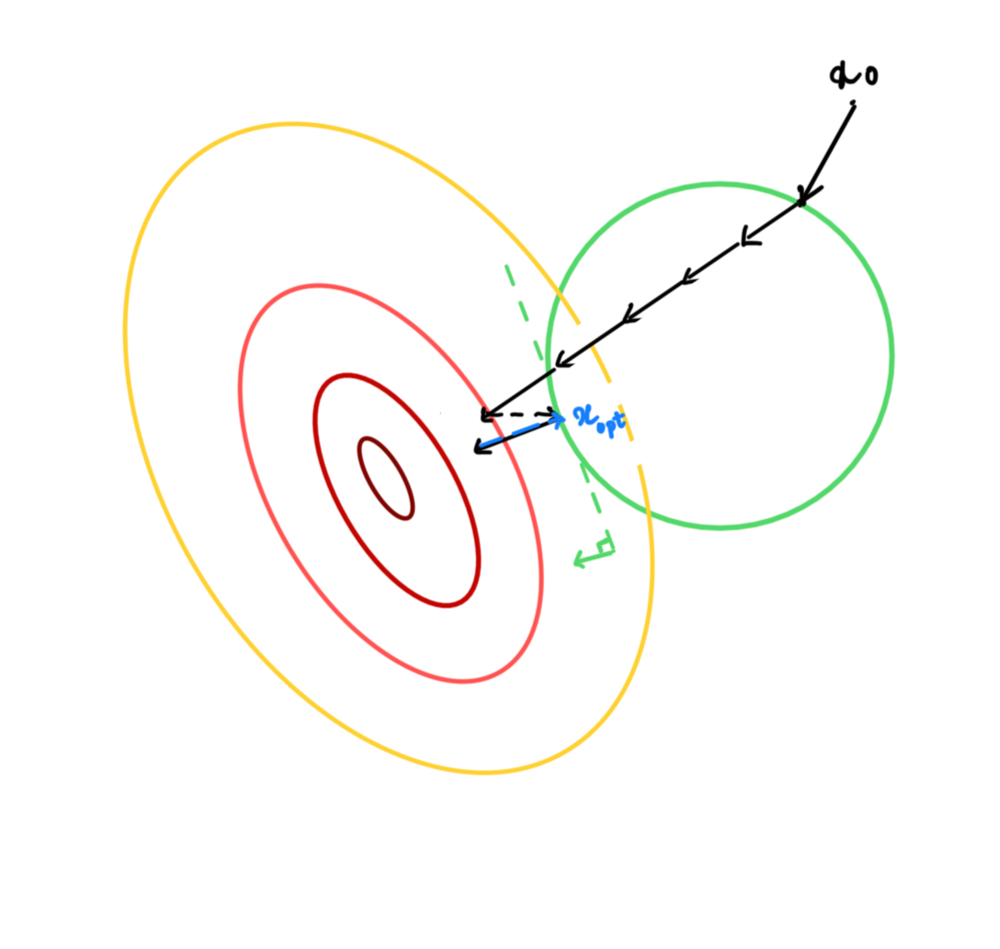
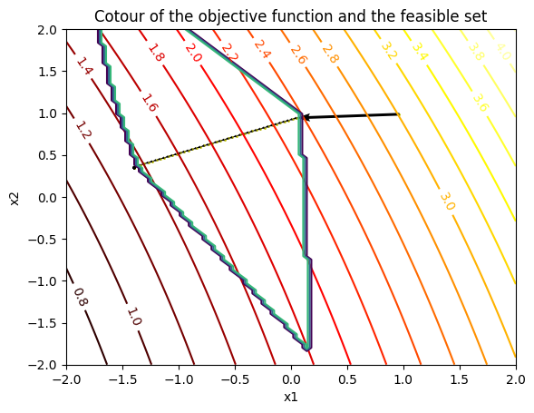

+++
title = "Solving an Adverserial Optimisation problem"
date = 2024-02-07T21:44:16-05:00
draft = false
description = "Solving an Adverserial Optimisation problem"
math = true
pygmentsUseClasses=true
pygmentsCodeFences=true
tableOfContents = true
+++


We will be solving the constrained optimisation problem, a simple version of the one used in the adverserial machine learning. and show that projected gradient descent (PGD) works with a simple example.
<span id='eq1'>
$$
\begin{align}
\min_x \log \sum_{i} e^{a_i^Tx +b}
\end{align}
$$
</span>
This is an unbounded problem, so the minimum value is $ -\infty $, However we can bound with norm constraints. Let's use $L_{\infty}$ to bound the problem. So adding the constriant to  <a href='#eq1'>(1)</a> will result in 
<span id='eq2'>
$$
\begin{align*}
\min_{x} \quad &  \log \sum_{i} e^{a_i^Tx +b} \\\\\\ 
\textrm{s.t.} \quad & || a_i^Tx +b ||_{\infty} \le \epsilon \tag{2}
\end{align*}
$$
</span>

Instead of minimising  <a href='#eq1'>(2)</a> We will minimize the lower bound. ( how tight is the lower bound is another topic of discussion. ). The lower bound is given by jensen's inequality, for any concave function, $f(\sum_i x_i) \ge \sum_i f(x_i)$. This is shown in the <a href='#fig1'>Fig.1</a> below.
<center>
<span id='fig1' style="align-content-center">
<figure>
  
  <figcaption>Fig.1 Visualisation of jensen's inequality for Concave function <a href= "https://kivanccakmak.com/posts/math/jensens_inequality/img/concave.png">credit</a> </figcaption>
</figure>
</center>
$\log \sum_{i} e^{a_i^Tx +b} = \sum_{i} \log e^{a_i^Tx +b} = \sum_{i} a_i^Tx +b$

Therefore using this lower bound <a href='#eq2'>Equation (2)</a>, Can be written as 
<span id='eq3'>
$$
\begin{align*}
\min_{x} \quad & \sum_{i} a_i^Tx +b \\\\
\textrm{s.t.} \quad & || a_i^Tx +b ||_{\infty} \le \epsilon \tag{3}
\end{align*}
$$
</span>
We can write the above equation in the matrix form,

$$
\begin{align*}
\min_{x} \quad &  1^T(Ax +b) \\\\
\textrm{s.t.} \quad & || Ax +b ||_{\infty} \le \epsilon 
\end{align*}
$$
The typical way to solve thos equation is to write in its equivalent form and then solve it's dual, we will be performing step by step optimisation. 
In step-1 we replace $A^Tx +b $ with $ y$ and add it as a constraint.

$$
\begin{align*}
\min_{x,y} \quad &  1^Ty \\\\
\textrm{s.t.} \quad & || y||_{\infty} \le \epsilon  \\\\
& Ax +b = y \tag{4}
\end{align*}
$$
The last constraint is redundant if $A^T$ is a full column rank matrics, becuase if you give it a y, we can find an x such that $A^Tx + b = y $, which is given by  $x = A^{-T}(y-b) $,  or columns of $A^T$ span the $R^d$, where d is the diamnesion of y, space.
Therefore the minimum value is given by base case all the y being $-\epsilon$, solution to Eq (4) is $-d\epsilon$, Everthying at the boundary. However this problems doesnot have a closed form if $A^T$ is not a full column rank matrix.

We will convert the above equation into its dual form, and convert the infinite norm contraint to an Linear problem, and we can easily solve LP by solving system of linear equation, but for our example we will use cvxpy <a href='#references'>[2]</a> for solving LP.

Writing the dual form
$$
\begin{align*}
g(\lambda, \mu, \nu) = \inf_{x,y} \quad &  1^Ty + \lambda^T (y - \epsilon)+ \mu^T (-y - \epsilon) + \nu^T(Ax+b-y) \\\\
\textrm{s.t.} \quad & \lambda \ge 0, \mu \ge 0 
\end{align*}
$$

Rearranging the terms of the above equation.
$$
\begin{align*}
g(\lambda, \mu, \nu) =  \inf_{x,y} \quad & ( 1^T + \lambda^T - \mu^T -  \nu^T )y + \nu^TAx - \epsilon (\lambda^T + \mu^T) + \nu^Tb \\\\
\textrm{s.t.} \quad & \lambda \ge 0, \mu \ge 0   \tag{5}
\end{align*}
$$
$1^T + \lambda^T - \mu^T -  \nu^T \ne 0$ Then y can take the oposite size and can be -$\infty$, Therefore the coeficients of unbounded functions in variables should be 0.

$
g(\lambda, \mu, \nu)  = \begin{cases} 
      -\infty & 1^T + \lambda^T - \mu^T -  \nu^T \ne 0 \\\\
      -\infty & A^T\nu \ne 0 \\\\
      -\infty & \lambda <0; \mu <0 \\\\
    - \epsilon (\lambda^T + \mu^T) + \nu^Tb  & 1^T + \lambda^T - \mu^T -  \nu^T = 0 ; A^T\nu = 0 \\\\
     & \lambda \ge 0; \mu \ge 0
\end{cases}
$

We want to get the tightest lower bound to the primal problem, As the problem is convex, and from the hyperplan seperation theorm, <a href='#references'>[1]</a>. We have solution to primal = solution to dual.

$$
\begin{align*}
\max g(\lambda, \mu, \nu)  =& \max &- \epsilon (\lambda^T + \mu^T) + \nu^Tb \\\\
&\textrm{s.t.} \quad & 1^T + \lambda^T - \mu^T -  \nu^T = 0 \\\\
&& A^T\nu = 0 \\\\
& & \lambda \ge 0; \mu \ge 0
\end{align*}
$$

We can eliminate $\mu$ from this euquation, We are able to eliminate $\mu$  because it is redundant in the sense that if $\lambda =0$ then $\mu \ne 0$, becuase if the legrange variables are 0, the the condition is euality constraint or the solution is at the boundary.


$$
\begin{align*}
\min_{\lambda,\nu} \quad & 2* \epsilon^T \lambda - (b+\epsilon)^T\nu\\\\
\textrm{s.t.} \quad & v \le 1 + \lambda \\\\
& A^T\nu = 0 \\\\
& \lambda \ge 0 \tag{7}
\end{align*}
$$
Now everyhting is Linear, this problem doesnot have a closed form solution but can be solved with any Convex optimisation solver. The question is how can you go back and solve the initial problem from the solution to this problem.

We use the KKT conditions and primarily, we calculate $\lambda$ and $\mu = 1 + \lambda -  \nu$, from KKT we know that if $\lambda, \mu \ne 0$ then the constraint corrospoinding to the constraint satisfy equality. We can plug the $y_i=\epsilon$ if $\lambda_i \ne 0$ or $-\epsilon$
if $\mu_i \ne 0$, If both are not zero we can't really get the value of y.
So plug back the indices into $A_ix+b_i = y_i$ this is a new system of equation which will give us the value of x and y.

Now we will go through the implementation of these constrainted optimisation problem for some value of A,b and we emperically say that both will give us the same solution.
$$
A = \begin{bmatrix}
        0.42653338 &  0.01419502 \\\\
        0.33599965 & 0.34548836 \\\\
        0.97202155 & 0.2533662  \\\\
        0.83768142 & 0.13944988 \\\\
        0.9881595 & 0.68442012 \end{bmatrix}
b = \begin{bmatrix}
        0.95011621 \\\\
        0.62676223 \\\\
        0.22844751 \\\\
        0.14841869 \\\\
        0.09432889 
    \end{bmatrix} 
\epsilon = 1
$$

Solving either directly primal and alternative dual ( we call this alternative because its not exactly dual because we added a new variable y) we get the same solution.

$$
x = \begin{bmatrix} -1.35816245 \\\\
        0.36198854\end{bmatrix}
$$

<table style="width:50%">
<tr>
<th style="width:50%"> 

```Python
import numpy as np
import cvxpy as cp

x = cp.Variable(x.shape)
objective = cp.Minimize(c.T @ (A @ x + b))
constraints = [cp.norm_inf(A @ x + b) <= eps]
prob = cp.Problem(objective, constraints)
print(x.value)
``` 
</th>
<th tyle="width:50%">
    
```Python
import numpy as np
import cvxpy as cp

v = cp.Variable((5, 1))
l = cp.Variable((5, 1))
o = np.ones((5,1))*eps*2

#dual form derivied in (7)
objective = cp.Minimize(   o.T @ l - (eps + b).T @ v )
constraints = [l>=0,A.T@v==0,v<=l+c]
prob = cp.Problem(objective, constraints)
prob.solve()

lam = l.value
mu =  c+l.value-v.value

#The indices where the constraints are met
indices = (np.where(lam[:,0]>1e-5) , np.where(mu[:,0]>1e-5))

e = eps* np.ones(b.shape)
new_A = np.concatenate([A[indices[0]],A[indices[1]]])
new_b = np.concatenate([b[indices[0]],b[indices[1]]])
new_y = np.concatenate([e[indices[0]],-e[indices[1]]])

new_x = np.linalg.inv(new_A)@ (new_y - new_b)
```

</th>
</tr>
</table>

This problem is much simpler problem, the f(x) is linear or the relaxed version of logarithemic exponetiation, alays solving direct constraint optimisation is not possible. So We will work with an iterative approach called Projected Gradient Descent (PGD). The idea is if the x after every iteratation is outside of the feasible space, project it back to the feasible space.

## Projected Gradient Descent

We will make a sketch of the termination criteria, We will write a proof for convergence which follows similar lines of proving convergence of gradient descent. 

<center>
<span id='fig2'>

<figcaption>Convex set green indicates feasible region, shades of red indicate the contour of the objective function, darker indicate low values. The figure showcases the termination condition, when the gradient of optimisation funciton is orthogonal to tangent (gradient is in null space of the tangent plane.)( 1st condition of KKT is met) </figcaption>
</span>
</center>

### What is a projection operation
projection is solving an simpler optimisation problem compared to the initial optimisation, which is done as follows.
$$
\begin{align*}
\min \quad & || x - \tilde{x} ||_2^2 \\\\
\textrm{s.t.}  \quad & x \in \mathcal{C} \\\\
\textrm{where} \quad & \tilde{x} = x_t - \alpha \nabla f(x_t)
\end{align*}
$$


### Proof of convergence
We will solve for linear case and assume it extends for non linear case or leave the non linear case for the future.

Assumptions
- funtion is differentiable
- function is Lipsitz smooth ( $|| \nabla f(x_1)  -  \nabla f(x_2) ||_2 \le L|| x_1 - x_2||_2$)
- function is convex, ( derivative slope line is the lower bound everywhere)
- constraint set is linear ( can be extended to non-linear )
$$
\begin{aligned}y\\
f\left( x^{\ast }\right) \geq f\ln  >t+\nabla f\left( x\right) ^{T}\left( x-x^{\ast }\right)
\end{aligned}
$$

### Example problem

Sharing the results of the same problem mentioned above This method gives us the same solution as the earlier approaches but is more helpfull for complex functions.

```Python
for epoch in range(100):
    x -= 0.01 * (A.T @ c)

    #solving primal projection operation
    new_x  = cp.Variable(x.shape)
    objective = cp.Minimize(cp.norm(new_x - x, 2)**2)
    constraints = [cp.norm_inf(A @ new_x + b) <= eps]
    prob = cp.Problem(objective, constraints)
    prob.solve()
    
    x = new_x.value  
print(x)
``` 
<center>
<span id='fig3'>

<figcaption> Left most point is the optimal point, showing the convergence of projective gradient descent.
</span>
</center>


## Using optimiation for white-box adverserial attacks


<h1 id="references">References<a hidden class="anchor" aria-hidden="true" href="#references">#</a></h1>
<p>[1] S. Boyd and L. Vandenberghe, Convex Optimization. Cambridge University Press, 2004.</p>
<p>[2] S. Diamond and S. Boyd, <a href="https://www.cvxpy.org/index.html">&ldquo;CVXPY: A Python-embedded modeling language for convex optimization.&rdquo;.</a> Journal of Machine Learning Research, vol. 17, no. 83, pp. 1–5, 2016.</p>
<p>[3] Ryantibs, &ldquo;  <a href=" https://www.stat.cmu.edu/~ryantibs/convexopt-F13/scribes/lec6.pdf">Convergence of gradeint descent </a>&ldquo;</p>


