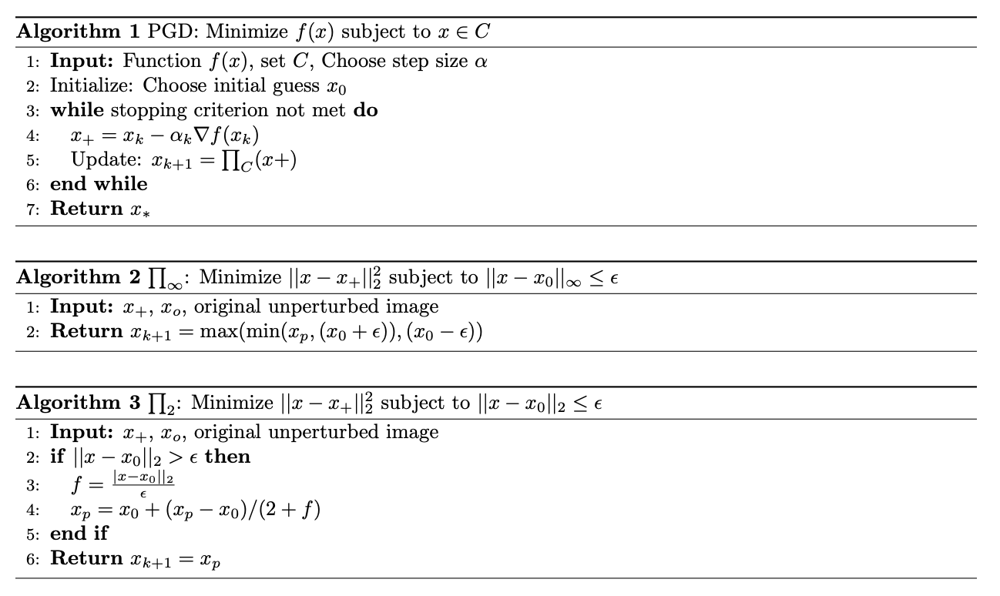

+++
title = "Solving an Adverserial Optimisation problem"
date = 2024-02-07T21:44:16-05:00
draft = false
description = "Solving an Adverserial Optimisation problem"
math = true
pygmentsUseClasses=true
pygmentsCodeFences=true
tableOfContents = true
+++

We will be solving the constrained optimisation problem, a simple version of the one used in the adverserial machine learning. and show that projected gradient descent (PGD) works with a simple example.

$$
\begin{align}
\min_x \log \sum_{i} e^{a_i^Tx +b}
\end{align}
$$

This is an unbounded problem, so the minimum value is $ -\infty $, However we can bound with norm constraints. Let's use $L_{\infty}$ to bound the problem. So adding the constriant to  <a href='#eq1'>(1)</a> will result in 

$$
\begin{align*}
\min_{x} \quad &  \log \sum_{i} e^{a_i^Tx +b} \\\\\\ 
\textrm{s.t.} \quad & || a_i^Tx +b ||_{\infty} \le \epsilon \tag{2}
\end{align*}
$$

Instead of minimising  <a href='#eq1'>(2)</a> We will minimize the lower bound. ( how tight is the lower bound is another topic of discussion. ). The lower bound is given by jensen's inequality, for any concave function, $f(\sum_i x_i) \ge \sum_i f(x_i)$. This is shown in the <a href='#fig1'>Fig.1</a> below.

<figure>
  
  <figcaption>Fig.1 Visualisation of jensen's inequality for Concave function <a href= "https://kivanccakmak.com/posts/math/jensens_inequality/img/concave.png">credit</a> </figcaption>
</figure>

$\log \sum_{i} e^{a_i^Tx +b} = \sum_{i} \log e^{a_i^Tx +b} = \sum_{i} a_i^Tx +b$

Therefore using this lower bound <a href='#eq2'>Equation (2)</a>, Can be written as 

$$
\begin{align*}
\min_{x} \quad & \sum_{i} a_i^Tx +b \\\\
\textrm{s.t.} \quad & || a_i^Tx +b ||_{\infty} \le \epsilon \tag{3}
\end{align*}
$$

We can write the above equation in the matrix form,

$$
\begin{align*}
\min_{x} \quad &  1^T(Ax +b) \\\\
\textrm{s.t.} \quad & || Ax +b ||_{\infty} \le \epsilon 
\end{align*}
$$
The typical way to solve thos equation is to write in its equivalent form and then solve it's dual, we will be performing step by step optimisation. 
In step-1 we replace $A^Tx +b $ with $ y$ and add it as a constraint.

$$
\begin{align*}
\min_{x,y} \quad &  1^Ty \\\\
\textrm{s.t.} \quad & || y||_{\infty} \le \epsilon  \\\\
& Ax +b = y \tag{4}
\end{align*}
$$
The last constraint is redundant if $A^T$ is a full column rank matrics, becuase if you give it a y, we can find an x such that $A^Tx + b = y $, which is given by  $x = A^{-T}(y-b) $,  or columns of $A^T$ span the $R^d$, where d is the diamnesion of y, space.
Therefore the minimum value is given by base case all the y being $-\epsilon$, solution to Eq (4) is $-d\epsilon$, Everthying at the boundary. However this problems doesnot have a closed form if $A^T$ is not a full column rank matrix.

We will convert the above equation into its dual form, and convert the infinite norm contraint to an Linear problem, and we can easily solve LP by solving system of linear equation, but for our example we will use cvxpy <a href='#references'>[2]</a> for solving LP.

Writing the dual form
$$
\begin{align*}
g(\lambda, \mu, \nu) = \inf_{x,y} \quad &  1^Ty + \lambda^T (y - \epsilon)+ \mu^T (-y - \epsilon) + \nu^T(Ax+b-y) \\\\
\textrm{s.t.} \quad & \lambda \ge 0, \mu \ge 0 
\end{align*}
$$

Rearranging the terms of the above equation.
$$
\begin{align*}
g(\lambda, \mu, \nu) =  \inf_{x,y} \quad & ( 1^T + \lambda^T - \mu^T -  \nu^T )y + \nu^TAx - \epsilon (\lambda^T + \mu^T) + \nu^Tb \\\\
\textrm{s.t.} \quad & \lambda \ge 0, \mu \ge 0   \tag{5}
\end{align*}
$$
$1^T + \lambda^T - \mu^T -  \nu^T \ne 0$ Then y can take the oposite size and can be -$\infty$, Therefore the coeficients of unbounded functions in variables should be 0.

$
g(\lambda, \mu, \nu)  = \begin{cases} 
      -\infty & 1^T + \lambda^T - \mu^T -  \nu^T \ne 0 \\\\
      -\infty & A^T\nu \ne 0 \\\\
      -\infty & \lambda <0; \mu <0 \\\\
    - \epsilon (\lambda^T + \mu^T) + \nu^Tb  & 1^T + \lambda^T - \mu^T -  \nu^T = 0 ; A^T\nu = 0 \\\\
     & \lambda \ge 0; \mu \ge 0
\end{cases}
$

We want to get the tightest lower bound to the primal problem, As the problem is convex, and from the hyperplan seperation theorm, <a href='#references'>[1]</a>. We have solution to primal = solution to dual.

$$
\begin{align*}
\max g(\lambda, \mu, \nu)  =& \max &- \epsilon (\lambda^T + \mu^T) + \nu^Tb \\\\
&\textrm{s.t.} \quad & 1^T + \lambda^T - \mu^T -  \nu^T = 0 \\\\
&& A^T\nu = 0 \\\\
& & \lambda \ge 0; \mu \ge 0
\end{align*}
$$

We can eliminate $\mu$ from this euquation, We are able to eliminate $\mu$  because it is redundant in the sense that if $\lambda =0$ then $\mu \ne 0$, becuase if the legrange variables are 0, the the condition is euality constraint or the solution is at the boundary.

$$
\begin{align*}
\min_{\lambda,\nu} \quad & 2* \epsilon^T \lambda - (b+\epsilon)^T\nu\\\\
\textrm{s.t.} \quad & v \le 1 + \lambda \\\\
& A^T\nu = 0 \\\\
& \lambda \ge 0
\end{align*}
$$
Now everyhting is Linear, this problem doesnot have a closed form solution but can be solved with any Convex optimisation solver. The question is how can you go back and solve the initial problem from the solution to this problem.

We use the KKT conditions and primarily, we calculate $\lambda$ and $\mu = 1 + \lambda -  \nu$, from KKT we know that if $\lambda, \mu \ne 0$ then the constraint corrospoinding to the constraint satisfy equality. We can plug the $y_i=\epsilon$ if $\lambda_i \ne 0$ or $-\epsilon$
if $\mu_i \ne 0$, If both are not zero we can't really get the value of y.
So plug back the indices into $A_ix+b_i = y_i$ this is a new system of equation which will give us the value of x and y.

Now we will go through the implementation of these constrainted optimisation problem for some value of A,b and we emperically say that both will give us the same solution.

## Projected Gradient Descent

<h1 id="references">References<a hidden class="anchor" aria-hidden="true" href="#references">#</a></h1>

[1] S. Boyd and L. Vandenberghe, Convex Optimization. Cambridge University Press, 2004.

[2] S. Diamond and S. Boyd, <a href="https://www.cvxpy.org/index.html">&ldquo;CVXPY: A Python-embedded modeling language for convex optimization.&rdquo;.</a> Journal of Machine Learning Research, vol. 17, no. 83, pp. 1–5, 2016.
