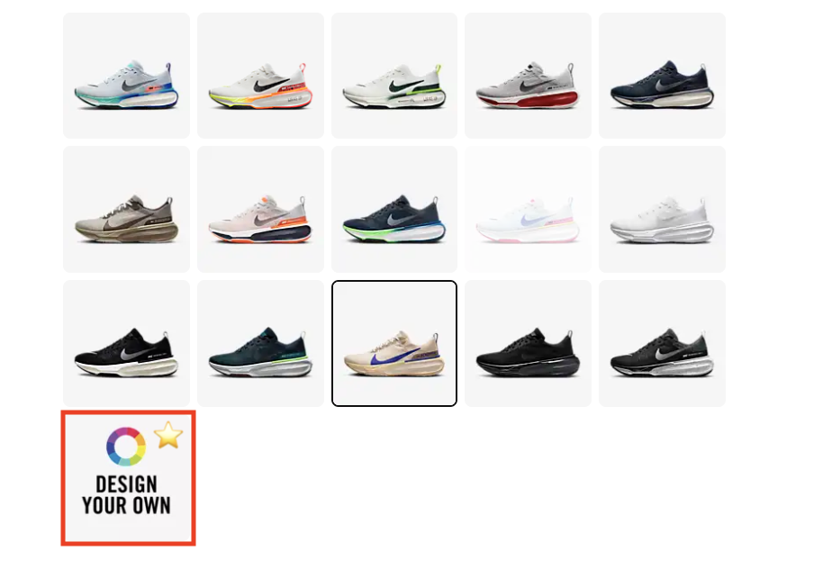
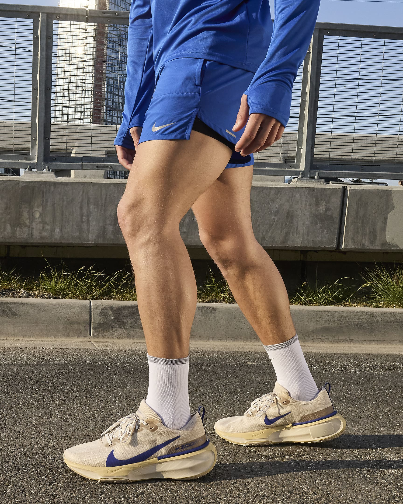
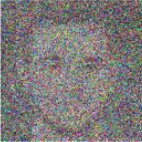
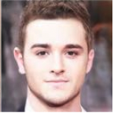
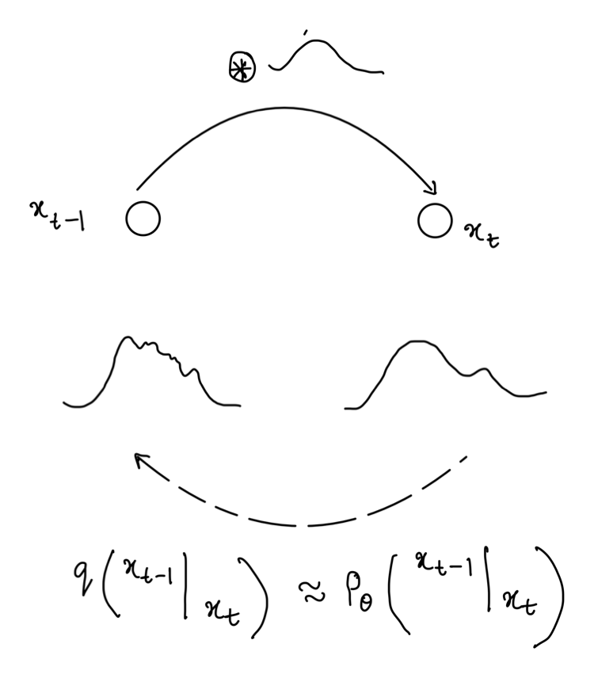

+++
author = "Sachit gaudi"
title = "Think Diffusion! Think Probability: A probablistic perspective of diffusion models"
date = "2024-10-09"
description = "Solving TikTok coding questions"
math = true
pygmentsUseClasses=true
pygmentsCodeFences=true
tableOfContents = true
draft = true
+++

[Still writing the blog yet to complete]

Structure:
    what are generative modes? You should be able to sample from p(x)
    How are you sampling from gaussian? [ Sample from inverse of CDF ]
    However for the images you have no idea of probability therefore Inverse CDF will not work
    How do model probability if you have samples from the distribution but dont have the formulation of the distribution
    VAE is one idea where you learn and we will see VAE is a special case of diffusion
    Other idea is GANs, (why dont GAN's dont work) [ perceptual loss is added but why? ( need to read more ) ] 
    Diffusion
        Lil'log has convered diffusion, but what you will learn is mostly from the Variantial loss perspective
        Energy based models which model probability as P(x)  = E
        Modelling Z can be avoided by learning score
        but remember the goal is that we need to sample from score. How do you do it? We leverage Langevin dynamics. Does VAE model score?
        what are the current works that use the probability perspective?
            Classifier-free guidance 
            Our work
            Textual inversion is a form of negation. 
            
             
        

<!-- 
The goal of this blog post is understand Image editing. The problem we want to solve is simple. Replace Y in X with Z. This problem solves pain for many e-commerce product marketers. Big power houses like Nike, does not shoot the ads for all the variants. Can we try new variant of the shoe on the model?
<table><tr>
<td>  </td>
<td>  </td>
</tr><caption style="caption-side:bottom"> <a href="#5">Nike products with only one product variant tried on a fashion model</a>
 </caption>
</table>

We will solve this problem with DreamBooth[\[6\]](#6) and SDEdit[\[7\]](#7), both of them are guided diffusion techniques. The primary purpose of this blog is to educate on diffusion models with focus on implementation. ### Generative modelling-->

<!-- Generative modeling is becoming increasingly popular. ChatGPT, which uses masked language modeling for training, has taken the world by storm. Similarly, DALL-E can create realistic images by being trained through the diffusion process.

The cat sat on the mat => The cat [MASK] on the mat. The task given to the GPT is to predict what goes in [MASK]. The model ( a function f ) is trained on many such sentences. Once you give "The cat", model will start generaing the next word. Suppose the next likely word is "slept" and this process continues auto regresively till it generates "The cat slept on the mat [EOS]" -->

<table  align="right" style="width: 150px;height: 75px;"><tr>
<td>  </td>
<td>  </td>
</tr>
</table>

Similarly, arbitrary noise is added to the image, and the goal of the model is to predict the added noise. However, if very little noise is added, the model will simply learn to copy the color in the next pixel. On the other hand, if too much noise is added at once, the context required for learning will be lost. Therefore, diffusion models are trained with a noise schedule. Small amounts of noise are added at each step, and then we learn $f(x_0 + n_t,t) = x_0$, where $n_t$ is the noise added till time step $t$.

We can also think of generative modeling as learning a transformation function that goes from a known distribution to the unknown. For example, we want to sample from a Normal distribution. We first sample from a uniform distribution and then apply the inverse CDF of the Normal to get the new random variable whose distribution is Normal (side not: Inverse cdf of normal disritbution does not have a closed form. So polynomial approximation is used in all the modern libraries [\[7\]](#7))

We can express this as follows: for a random variable $z$ with a known distribution (uniform in our example), we learn a function $f$ (the inverse CDF of the distribution we want to sample from). Then, we sample $x$ such that $x = f(z)$, where $z \sim U[0,1]$. Since we have no knowledge of the inverse CDF of an unknown sampling process, we approximate it with a neural network. This will be the common theme in Deep Learning, if you are not sure on the function replace it with neural network and learn it with samples.

Suppose if we want to generalise sampling from gaussian instead of uniform mentioned above, we can apply $y = \phi_{unk}^{-1}(\phi_n(x))$, where $x \sim \mathcal{N}(0,1)$ and $\phi_n(\cdot)$ is cdf of unit normal. So our goal is to learn $\hat{f} = \phi_{unk}^{-1}(\phi_n(\cdot))$

We will be covering VAE, score and Denoising diffusion (DDPM) in this blog. The overarching idea is the same from the three techniques. We will first cover base VAE, and extend it to higerarchial vae. and then show that score based models are higerarchial VAEs with a fixed functional form for forward process given by $f(t)$ and $g(t)$ and the solution is equivalent to solving an SDE. DDPM is a simpler version of score modelling by fixing $f(t) = \beta_t$ as mentioned in [\[8\]](#7)
### VAE 
We will explain VAE and 

### Diffusion Models

Diffusion models have been extensively studied, and there is a lot of literature available to learn from [\[1](#1) - [4\]](#4). Generally, diffusion is explained theoricatlly and directly moved to a complex problems. However, in this blog we try to explain diffusion on toy problems. 

First, Can we generate the samples from the 8-mode gaussian ( pdf of the distribution is as described below). As the data is 2 diamensional it is easy to visualise and understand the diffusion process. Then we move onto generating digits with a respective color. Then given a style of a digit and color of the digit model should try to generate such a digit. Once we are able to solve the problem of generating a digit with a color.

### Theory of Diffusion

In this section, we briefly cover what is included in `score.py`. This section contains some math. We will try to cover the preliminaries and do our best to explain things visually.

We add noise in a perticular way.
$x_t = \sqrt{\alpha_t}x_0 +  \sqrt{1- \alpha_t}z$, where $z \sim \mathcal{N}(0,1)$

### Diffusion as VAE 
 
The image dipicts how VAE and diffusion are connected. In VAE we go from Image domain to the latent domain. We enforce the latent to be gaussian $\mathcal{N}(0,1)$  by constrianing latent with KL divergence. Then the decoder learns the inverse transformation of it. This notion of VAE is very similar to 
We can also see this probability matching for VAEs and Diffusion, we will 

### Conditional generation

They however used VQVAE intead of VAE. The rest architecture will remain the same.

### References
<a id="1">[1]</a> Chan, S. H. (2024). Tutorial on Diffusion Models for Imaging and Vision. arXiv preprint arXiv:2403.18103. https://arxiv.org/pdf/2403.18103.pdf.

<a id="2">[2]</a>  Weng, Lilian. (Jul 2021). What are diffusion models? Lil’Log. https://lilianweng.github.io/posts/2021-07-11-diffusion-models/.

<a id="3">[3]</a>  Vishnu Boddeti. (2024). Deep Learning. https://hal.cse.msu.edu/teaching/2024-spring-deep-learning/

<a id="4">[4]</a>  Arash Vahdat. et al. (2022). CVPR. https://cvpr2022-tutorial-diffusion-models.github.io/

<a id="5">[5]</a>  Nike Invincible 3. https://www.nike.com/t/invincible-3-mens-road-running-shoes-6MqQ72/DR2615-007

<a id="6">[6]</a> Ruiz. et al. (2022).  DreamBooth: Fine Tuning Text-to-image Diffusion Models for Subject-Driven Generation. https://dreambooth.github.io/

<a id="7">[7]</a> Khanh Nguyen, MTI Technology. https://medium.com/mti-technology/how-to-generate-gaussian-samples-347c391b7959

<a id="8">[7]</a> Khanh Nguyen, MTI Technology. https://medium.com/mti-technology/how-to-generate-gaussian-samples-347c391b7959