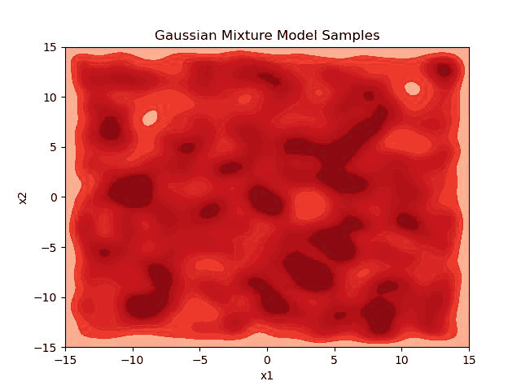

+++
title = 'Generative models: VAE, Score, and Diffusion'
date = 2024-04-29T17:37:27-04:00
draft = false
+++

Diffusion models have been extensively studied, and there is a lot of literature available to learn from [\[1](#1) - [4\]](#4). In this blog we will try to explain intutively with the example of 8-mode gaussian generation.

More details are to be added.

### References
<a id="1">[1]</a> Chan, S. H. (2024). Tutorial on Diffusion Models for Imaging and Vision. arXiv preprint arXiv:2403.18103. https://arxiv.org/pdf/2403.18103.pdf.

<a id="2">[2]</a>  Weng, Lilian. (Jul 2021). What are diffusion models? Lil’Log. https://lilianweng.github.io/posts/2021-07-11-diffusion-models/.

<a id="3">[3]</a>  Vishnu Boddeti. (2024). Deep Learning. https://hal.cse.msu.edu/teaching/2024-spring-deep-learning/

<a id="4">[4]</a>  Arash Vahdat. et al. (2022). CVPR. https://cvpr2022-tutorial-diffusion-models.github.io/
