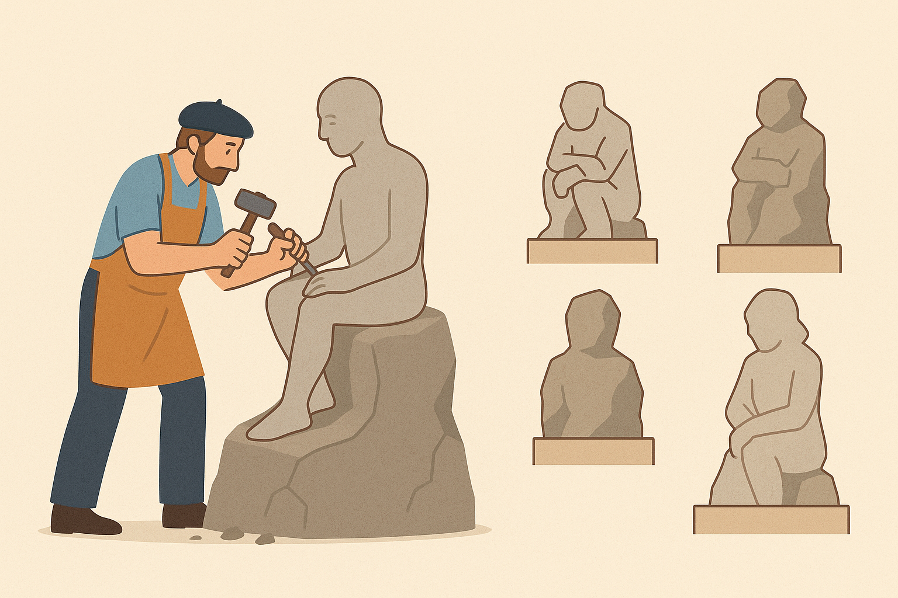

+++
title = "Master’s Done Right: Lessons for a Joyful and Successful Journey"
date = 2025-10-18T17:27:07-04:00
draft = false
math = true
pygmentsUseClasses=true
pygmentsCodeFences=true
tableOfContents = true
+++

There’s plenty of advice out there for PhD students and undergraduates, but very little for those pursuing a master’s degree. I want to share the lessons and practices that made my own master’s both successful and deeply enjoyable.

I was an average student in undergrad by all metrics. Yet during my master’s, I was somewhat considered successfull — I published a paper in a top-tier conference, secured a machine learning job, and, most importantly, found genuine joy in what I was doing.

It took me two and a half years to graduate — longer than usual — but I’d call it a “half-PhD.” That journey transformed how I think, work, and live.

### Why do I want to pursue a Masters degree?

Everyone should have an answer to this question. Even if you don’t know every detail at the start, you should have a guiding goal — a north star you want to reach. For me, that goal was to write a paper like [this](https://arxiv.org/pdf/2010.02650) EMNLP paper I came across during an oral talk at the conference. What fascinated me wasn’t the final result, but the way the author reasoned through the problem to arrive at a solution.

If you’re lucky, you might discover your purpose early. But for me, it took a mix of exploration and exploitation. In my case, I read widely across economics, mathematics, design, and machine learning. I explored many resources available — attending [IIIT hyderabad summer school](https://cvit.iiit.ac.in/summerschoolseries/), earning ML certification from  [IIT KGP](https://cvit.iiit.ac.in/summerschoolseries/), joining paper-reading sessions, and online courses. That’s what ultimately led me toward research and the decision to pursue a master’s degree.

### Reasons to consider enrolling in a Masters program

**Dedicated time** to explore what you think you love. To explore any topic deeply—be it research or learning a new skill—allocating dedicated time greatly increases the chances of success in your pursuit. By enrolling in a master’s program, you are intentionally setting aside that time, thereby increasing your chances of building a career around what you truly love.

**Calculated Risk:** Research is inherently risky. But during your master’s, it’s one of the safest times to take those risks. If your idea fails, you still gain valuable research skills and earn a course-based degree. If it succeeds, the rewards—publications, recognition, and job opportunities—are often disproportionate to the effort. It’s a limited-downside, with huge upside.

**Freedom & Independence:** You’re free to choose the problems that interest you—or even to spend time developing a sense of what kinds of problems excite you. Unlike a corporate setting, you don’t have a boss assigning tasks. You control your direction, pace, and curiosity.

**Research Opportunity:** Professors are usually generous in giving motivated students a chance. At the master’s level, you’re often unproven and still learning how to do research, yet many professors are willing to guide you through that process.

**Access to smart folks:**  The research community has a selection bias of smart folks. You’ll find yourself surrounded by PhD students and peers who think deeply about complex problems. Ideas flow freely in such environments, and you’ll often find people willing to help you arrive at solutions together.

If you already have all of these—freedom, time, access to great mentors, and the ability to take risks—then you might not need a master’s degree. 

### How to Maximize Your Master’s Program

  <!-- Image -->
  

  <!-- Quote -->
  

    

      “Two roads diverged in a wood, and I— 
      I took the one less traveled by, 
      And that has made all the difference.”
    

    
— Robert Frost

  

During your master’s, you’ll constantly face two paths: the easy one and the challenging one. Always choose the latter.

The easiest way to earn a master’s is by completing your courses diligently.  Yet, in all my interviews, not a single person asked which courses I took or what grades I earned. In graduate school, **grades don’t matter — unless you mess them up badly.**

So how should you choose your courses? The purpose of a course is to find your collaborators. **Pick courses that could lead to research opportunities in a lab.** They’re the best way to demonstrate your curiosity, thinking process, and work ethic — and an easy way to convince a professor to take you on as a student. Sometimes, go with your gut; you might discover unexpected collaborations.

**Projects** make up a large part of your graduate courses, the difficulty of the projects depends on you.  In one of my courses, we were given three options: write a literature survey, reimplement a research paper, or explore something novel. To my surprise, most students chose the first two. Those are, in my opinion, the worst choices you can make—safe, short-lived, and rarely pursued beyond the course. 

When choosing projects, avoid the common pitfalls:

1. Most projects last only a few weeks and are soon abandoned.
2. Many projects are superficial — like running all algorithms in SciPy and announcing that Random Forests outperform the rest, or training Faster-RCNN for hand detection.

These projects are good practice and earn solid grades, but they rarely contribute anything new to the community. If you work on a typical course project, no one will remember it — not even your professor. Such projects are rarely revisited and are often discounted during PhD admissions or job interviews. 

So how should you pick a project?  **Design your project as a piece of a larger research question** When you do that, your audience naturally expands — it’s no longer just your professor, but the broader research community. What truly matters is working on a problem for a long time. Research is, at its core, a long and evolving project. Almost every meaningful research idea begins as something small — a class project, a weekend curiosity — and grows deeper as you continue to explore it. The more you question, refine, and iterate, the more original and interesting your work becomes.

Case Study: My own research journey started in the most ordinary way — with a class assignment. My advisor was teaching Score-Based Generative Models, and the assignment was to implement a simple version of one. After finishing the assignment, I was curious on how well score based generative models generalize? —  a question closely tied to my broader research interest in generalization. Initial experiments revealed that these models don’t generalize well. From there, the solution emerged naturally from understanding why they fail. In fact, most of the later experiments grew directly from a fork of the base code provided for that original assignment.

 
### How to Choose the Right School

Pick a school with the high ranking on [csrankings](https://csrankings.org/) in your field of study.

The higher the ranking, the greater your chances of success — both in research and in landing a good job. You’ll have a wider range of professors and problems to choose from, and if a particular advisor or topic doesn’t fit, you can switch. The school’s reputation also matters more than you think; [hiring trends](https://anandbhattad.github.io/blogs/jr_grads.html) of graduates consistently reflect this

Also, look for a school with a high ratio of PhD students to master’s students. That’s a strong signal the program values research and doesn’t treat the master’s degree as a cash cow. In addition, you’ll find more opportunities for research and teaching with less competition.

The application process for master’s programs, however, can be unpredictable. You may not end up exactly where you expect. To improve your odds, write an honest statement of purpose and reach out to professors directly instead of relying solely on your online application.

Case Study: Most top schools rejected me, but Michigan State University (MSU) accepted my application. MSU turned out to be a great fit — it’s well-ranked in Computer Vision and has a high PhD-to-master’s ratio (about 1.0). If you are consider specialization in Computer Vision, MSU makes a very good case.

### Which ~~Professor~~ Lab Should You Join?

Karpathy, in his [blog](https://karpathy.github.io/2016/09/07/phd/), outlines several factors to consider when choosing a advisor. Most of them apply to master’s students as well, but some are more important.

**Helpful Labmates:** This is the most important, especially if you are a masters student. The most you are gonna learn and spend time with is your labmates. So pick a lab which has the most smart and helpful folks. If there is a tradeoff between smart and helpful, always pick the helpful bunch.

Case study: 
My labmates were the single most important factor in my success. My presentation and articulation skills improved simply by observing them — how they structured their presentations and discussed ideas. When my writing was weak, they not only rewrote sections but also explained why their version conveyed the ideas more effectively. They shared resources freely, and when I was stuck on a proof, they’d chime in to help me complete it.

On the contrary, once I asked someone incredibly talented for a small piece of help. The conversation went nowhere, and I was soon left on my own — losing valuable time in a crucial phase of my project. So, before joining a lab, try to have a conversation with one of the lab members. If they don’t have few minutes for you, run the other way.

**Interest and Style of Problems:** Because a master’s program is short, you won’t have time to change the lab’s research direction or style. It’s better to choose a lab that already aligns with your interests and way of thinking. Every lab has published papers — read them. Do any of them excite you? Can you imagine yourself writing a paper like that? The more such papers you find, the better the fit. I chose to join Dr. Boddeti’s lab for its strong culture of scientific thinking and rigor.

**Lead vs. Follow** My advisor’s first question to me was, “Will you work on something independently, or collaborate with one of the PhD students? If I were you, I’d choose the first one.” I now pass on the same advice

Working independently allows you to interact directly with your professor — essentially a more experienced and refined version of a PhD student. Professors have broader perspective and a sharper sense for which ideas are worth pursuing.  PhD students, on the other hand, are often focused on building their own niche. If your interests diverge from theirs, you might find little alignment or guidance. They may also lack the experience to mentor you through the research process beyond their immediate area.

Professors often recognize your skill gaps early and can connect you with others who can fill in those gaps.

Another benefit of working closely with a professor is the possibility of a strong, personal recommendation letter. Although this is rather a derivative  than something you plan on.

Caveat: Professors tend to be high-level thinkers. They won’t hand you step-by-step instructions, and you probably won’t operate at their level initially. This makes clear communication essential.

### Advice for Succeeding in Your Research Endeavor

**Nothing Beats Hard Work:**
There are no shortcuts in research. My undergraduate GPA was just 7.3, and I barely made it into a master’s program. The only way I got closer to my dreams was by showing up every single day and working hard. Even when my ideas failed, I kept making small progress toward understanding the problem. It made little sense at the time, but looking back, the effort compounded into something meaningful.

**Own Your Research:**
Most master’s students think it’s the professor’s research. To spoil it for you — it’s not. The professor doesn’t care about your project as much as you do, nor should they. It’s your responsibility to solve the problem. Why should the professor give you their precious time? They’re already swamped with deadlines and commitments. You’re competing for their attention, so you have to earn it.

Treat yourself as the one leading the research project — the professor is there to guide you. Take ownership. Read [You and Your Research by Richard Hamming](https://www.cs.virginia.edu/~robins/YouAndYourResearch.html) which captures what it truly means to do research.

**Writing and Communication Are Key**
I can’t emphasize enough how important communication skills are. By communication, I mean storytelling — connecting ideas, motivation, and results. To get better, write regularly. Maintain a running log or LaTeX document where you freely dump your ideas, proofs, and code links. To this day, I still struggle with this, but I keep trying to improve.

**Collaborate early** — ideally with a PhD student. They’ve already seen what a successful publication looks like, can guide your literature review, and help structure your thought process. You’ll also gain a companion to bounce ideas off. Many of my ideas were refined — or refuted — through such discussions. Every time I failed to convince someone, it revealed a blind spot I hadn’t seen, most likely reviewers will also spot them. In addition, When you hit mental blocks, collaboration adds new insights and prevents wasted effort down wrong paths.

**Review papers**, even before publishing your first paper. You can contribute as a reviewer (through recommendation by someone who knows your work). Reviewing teaches you to question every claim, identify gaps, and recognize what makes research convincing. In many ways, learning to ask the right questions is 80% of doing good research.

**Mental and physical health** Research is a deeply personal journey — you won’t be the same person who started it.
You’ll fail often, sometimes feel isolated, and no one will truly understand your internal battles. Don’t take setbacks personally;  Take learnings and keep working on things that you believe are true. When the need arises, use the counseling services your university offers.

I have failed in 3 research endeavours. I was unable to generate ideas, and the ideas I did have were outdated. I was also bad at communication. These were the reasons that got me fired. So it is very natural to feel low — you are alone in these battles, and you alone can keep your mental health alright.

Physical fitness improves mental clarity. For me, going to the gym or playing a sport 3–4 hours a week dramatically improved focus.

### Luck is a big factor

My entire research journey can be attributed to pure luck. Attributing it to anything else would just be pure stupidity.

I was lucky to find helpful labmates who cared enough to guide me. The lab itself was diverse, with so many open problems floating around that I could just pick one and start exploring. My role was mostly to hang around, listen, and connect two areas of research that two PhD students were working on.

I thought I already knew most of the deep learning. My advisor, however, suggested that I take his Deep Learning course. I enrolled at the very last moment — and that turned out to be one of the best decisions I made.

I was lucky to have a great advisor. When he saw me struggling at writing, he assigned one of the PhD students to help me, and he wrote the entire publication. On the other hand, my advisor, at every step, asked the right questions; all I did was diligently execute things.

### Fall in love

It might sound unrelated to academics, but it can indirectly help you succeed in them.

You can talk to your partner about research, and sometimes that will help you think more clearly and communicate better. At other times, it helps to take your mind off research completely, explore the city together, or do something simple and monotonous. It’s the mental reset your brain didn’t know it needed. Sometimes, you need emotional support with your context to navigate highs and lows of the research career.

### Derivatives of Research

Skills that ~~make you a great scientist~~ you learn while working on a research project:
1. Developing a taste for what problems are worth solving.
2. How to generate ideas and see them to execution.
3. How to critique ideas.
4. How to prioritize ideas.
5. How to navigate during uncertain times.
6. How to communicate effectively.
7. How to own a project end to end.

Whether you pursue a PhD or an industry role, these skills are immensely valuable. If your path is a PhD, you have no option but to try your luck at research. If you aim for industry, the same skills make you stand out and land exceptional roles.

In my experience, companies usually have two main rounds of interviews (though they might call them differently):
1. Breadth + Reasoning
2. Depth

Examples of Breadth + Reasoning include,  “How would you improve planning in autonomous vehicles?” “How would you generate social-media feeds to drive users toward a goal?”

These are open-ended research-style questions. For example, if you’re solving the problem of goal-driven social media, you can think of it as a sequence of next-post prediction given user context—similar to next-token prediction in LLMs. Since the goal is not differentiable, you could formulate the reward as an RL problem. It’s really about connecting the question to what you already know, thinking broadly, and reasoning through your thought process step by step. Reasoning skills come in handy if you work on research.

The Depth round is straightforward: pick one substantial project and explain it with clarity. You don’t need 100 projects—you need one that you truly understand end to end. The deeper your understanding and the clearer your explanation, the better. Research naturally gives you that edge.

## Concluding thoughts

I wish you all the luck in your own research journey. It’s a path filled with uncertainty, but also discovery and deep satisfaction.

