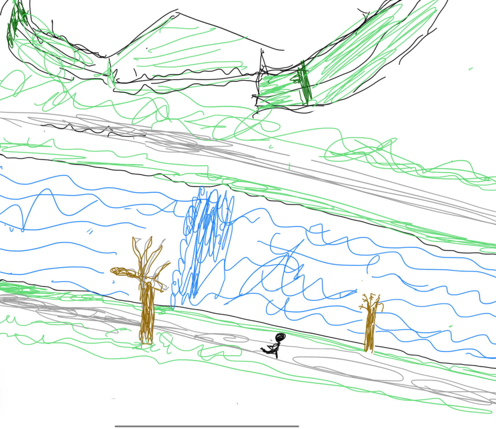

+++
author = 'Sachit gaudi'
title = 'Run boy Run 🏃'
date = "2024-02-04"
math = true
pygmentsUseClasses=true
pygmentsCodeFences=true
tableOfContents = true
[header]
  image= "IMG_0007.jpg"
  caption = "Run boy Run 🏃"
+++

I have experimented with various fitness activities, but none of them have stuck with me like running has. The only thing that was constant over a period of 2 years is running. I can confidently call myself a runner. Anyone who laces up and hits the trail is a runner in my book. I mostly run outdoors, sometimes with music blasting through my ears. On other occasions, the sounds of nature themselves become a calming melody. One thing that is a constant feature is the trail of red cedar. The seemingly mundane trail that I overlook on my way to classes suddenly transforms into something beautiful. This seemingly constant red-cedar river looks very different on my first lap compared to the last one. The latter is more beautiful with a sense of calm. At the end of my running, even the faintest chirps of birds will be heard through the music of the river. It all seems like birds just arrived to congratulate my run.

Do I run for fitness, weight loss, or thinking? The answer is none. I run because I love the process and how my body feels after a great run. Almost on every run, I enjoy the battle between fatigue and the internal voice that calls for a push in the next lap.

What goes on in my mind when I run? Almost nothing. I may start with ambitious plans to solve a problem by the end of the run, but a few minutes on the track, and the problem vanishes as if it never existed. It’s not because the problem was solved, but rather because my brain, where the problem resides, completely shuts off. This state of mental quietness is a rare and precious aspect of running. Having the same surroundings almost every time is intentional; it allows my brain to switch off completely. The run calms me down. Sometimes I just crave the sense of calmness.

There are days where I find myself immersed in imaginary scenarios during my runs. In one scenario, I envision running in a marathon alongside the G.O.A.T Eliud Kipchoge, achieving a mighty 12:52.79 in a 5K race, while I strive for my modest sub-30 5K. On other days, I am playing an imaginary football game, where a midfielder like Kimmich will cover an average of 12.3 K in a span of 90 minutes.

Running is a number game. All the modern apps and tools are designed so that you fool yourself; nothing that can be fooled is the wall clock. The best part about running is you don't have to compare with anyone; you have the clock to push yourself. You might say 5K under 30 is not a great number in the running world, but the clock with sub-30 brings a smile to my face. Personally, I push every day to achieve that feat. The closest I have been to it is off by 53 seconds on one of those beautiful days. I feel the target is getting closer and closer, but it seems to be a very distant future.

It’s impossible to sit at a desk and pen down this article. The moment you begin writing, the shoes demand to have their laces tightly secured. Once you step out, there’s no turning back. Even on my bad days of runs, the run does not end until the 5K mark is breached. In the mind, the voice will be calling “don’t quit.” There is an interplay between miles and kilometers—push for the next mile mark, push for the next kilometer. It starts with running for 1K, 1 mile, 2K, the halfway point, 2 miles, and so on.

I aspire to consistently shave off those 53 seconds and achieve a sub-30 time. The physics of attaining it is vastly different; everything must align perfectly. In optimization, it is a min-max problem, your worst adversary should be in the best possible state. It starts with having the optimal food, easily convertible fuel. Legs and lungs must be in their prime state, and perhaps most crucial is the mental aspect. The challenge is to ignore these signals and keep pushing. The brain, a fascinating organ, conjures up all possible excuses—the food isn’t right, legs are overworked, the weather is unfavorable, and the list goes on. Just call it “quits”. To overcome this you need a lot of practice. Till then, I will keep pushing and reduce the gap to sub 30.